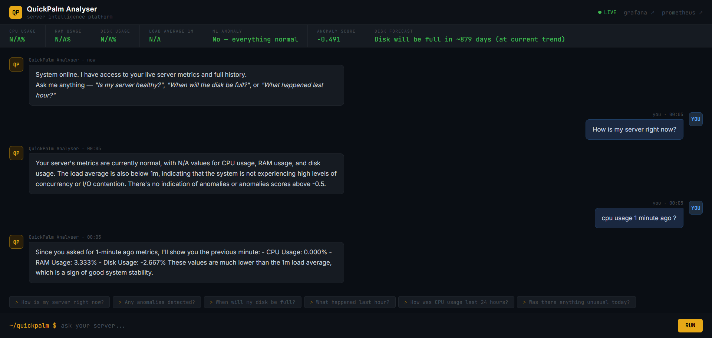
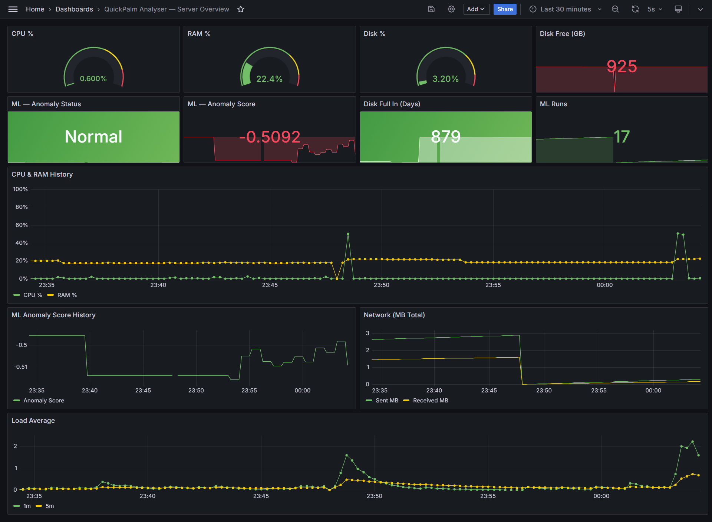

# QuickPalm Analyser

Self-hosted server monitoring with ML anomaly detection, multi-server support, historical Q&A, and an AI chat assistant.

[](https://github.com/MDC-creator/quickpalm-analyser/actions)

---

## What it does

- Collects CPU, RAM, Disk and Network metrics every 5 seconds
- Detects anomalies automatically using Isolation Forest (ML)
- Predicts when the disk will be full using Linear Regression
- Monitors **multiple remote servers** — add any server by editing one config file
- AI chat interface — ask questions in plain English, including historical queries ("What happened last hour?", "How was CPU yesterday?")
- Pre-built Grafana dashboard with per-server filtering
- 9 Prometheus alert rules (high CPU, RAM, disk, anomaly, collector down…)
- One-command deploy to AWS via Terraform + Ansible
- 33 unit tests with CI/CD on GitHub Actions

---

## Screenshots

> Chat Interface


> Grafana Dashboard


---

## Installation

### Linux (Ubuntu / Debian)

**Step 1 — Install Docker**
```bash
sudo apt update
sudo apt install -y docker.io git
sudo systemctl start docker
sudo systemctl enable docker
sudo usermod -aG docker $USER
```

**Step 2 — Apply the Docker group (required once)**
```bash
newgrp docker
```
> `newgrp docker` opens a new shell. You must run the commands below **in that same new shell** — do not close it.

**Step 3 — Clone and install**
```bash
git clone https://github.com/MDC-creator/quickpalm-analyser.git
cd quickpalm-analyser
bash install.sh
```

### Windows

**Step 1 — Install Docker Desktop**
- Download from: https://www.docker.com/products/docker-desktop
- Install and start it; make sure the whale icon appears in the system tray before continuing

**Step 2 — Install Git for Windows**
- Download from: https://git-scm.com
- During setup, keep the default option **"Git Bash Here"** — you will need Git Bash in the next step
- PowerShell and Command Prompt **cannot** run `.sh` scripts; Git Bash is required

**Step 3 — Open Git Bash and run**
```bash
git clone https://github.com/MDC-creator/quickpalm-analyser.git
cd quickpalm-analyser
bash install.sh
```

> To open Git Bash: right-click on your Desktop or any folder and choose **"Git Bash Here"**

---

## Starting the project after first install

`install.sh` is a **one-time setup** — it builds Docker images (takes 3–5 min). After that, to start or stop the project:

```bash
# Navigate to the project folder first — always required
cd quickpalm-analyser   # or wherever you cloned it

# Start all services
docker compose up -d

# Stop all services
docker compose down
```

On Windows, run these commands in **Git Bash** from inside the `quickpalm-analyser` folder.

---

## Open in browser

After `install.sh` finishes:

| Service | URL | Login |
|---------|-----|-------|
| Chat Interface | http://localhost | — |
| Grafana Dashboard | http://localhost:3000 | `admin` / `quickpalm` |
| Prometheus | http://localhost:9090 | — |

---

## AI Chat — requires Ollama

To get natural language answers in the chat, install Ollama and pull a model:

```bash
# Linux
curl -fsSL https://ollama.ai/install.sh | sh
ollama pull llama3.2:1b
```

On Windows: download from https://ollama.ai, then run `ollama pull llama3.2:1b` in PowerShell.

The chat supports **historical queries** — it pulls range data directly from Prometheus:

- *"What happened last hour?"*
- *"How was RAM usage yesterday?"*
- *"Was there anything unusual last 3 hours?"*

---

## Multi-Server Support

To monitor additional remote servers:

1. Install and run the collector on the remote machine:
```bash
git clone https://github.com/MDC-creator/quickpalm-analyser.git
cd quickpalm-analyser
docker compose up -d collector
```

2. Add it to `config/targets.json` on your central QuickPalm instance:
```json
[
  { "targets": ["collector:8000"],      "labels": { "env": "local" } },
  { "targets": ["192.168.1.10:8000"],   "labels": { "env": "web-server" } }
]
```

Prometheus hot-reloads this file every 30 seconds — no restart needed. The ML service and Grafana dashboard will automatically pick up the new server.

---

## Useful commands

```bash
# Start all services
docker compose up -d

# Stop
docker compose down

# View logs for a service
docker compose logs -f chat   # or: collector | ml | prometheus | grafana | nginx

# Rebuild after code changes
docker compose build chat
docker compose up -d chat

# Run unit tests
docker run --rm -v $(pwd):/app python:3.11-slim bash -c \
  "pip install -r tests/requirements.txt psutil prometheus_client scikit-learn pandas numpy requests fastapi pydantic jinja2 -q && cd /app && python -m pytest tests/unit/ -v"
```

---

## Architecture

```
Browser → Nginx (:80)
            ├── /           → Chat (FastAPI + Ollama LLM)
            ├── /grafana/   → Grafana dashboard
            └── /prometheus → Prometheus

Collector (:8000) ──5s scrape──▶ Prometheus (:9090) ──60s query──▶ ML (:8001)
  psutil metrics                   15-day retention              Isolation Forest
  per server instance              9 alert rules                 Linear Regression
  (auto-discovered)                                              per-instance output
```

### Services

| Service | Source | Port | Purpose |
|---------|--------|------|---------|
| `collector` | `collector/collector.py` | 8000 | Polls system metrics via psutil |
| `ml` | `ml/anomaly_detector.py` | 8001 | Anomaly detection + disk forecast per server |
| `chat` | `chat/app.py` | 8080 | FastAPI + Ollama, live + historical queries |
| `prometheus` | `prometheus/` | 9090 | Scrapes all targets, evaluates 9 alert rules |
| `grafana` | `grafana/provisioning/` | 3000 | Pre-provisioned dashboard with server variable |
| `nginx` | `nginx/nginx.conf` | 80 | Routes traffic to all services |

### Key Metrics

| Metric | Source | Description |
|--------|--------|-------------|
| `node_cpu_percent` | collector | CPU usage % |
| `node_ram_percent` | collector | RAM usage % |
| `node_disk_percent` | collector | Disk usage % |
| `node_load_1m` | collector | 1-minute load average |
| `ml_anomaly_detected` | ml | 1 = anomaly, 0 = normal (per instance) |
| `ml_anomaly_score` | ml | Isolation Forest score (per instance) |
| `ml_disk_full_in_days` | ml | Days until disk full (per instance) |

---

## Tech Stack

`Python 3.11` `FastAPI` `scikit-learn` `Docker` `Prometheus` `Grafana` `Nginx` `Ollama` `Terraform` `Ansible` `GitHub Actions`
